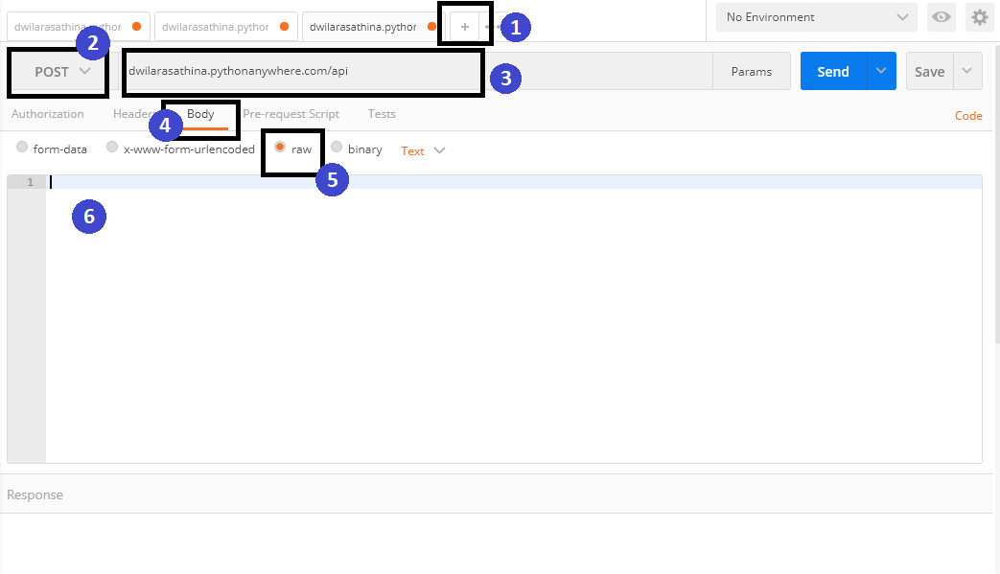

# Credit-Scoring-using-pythonanywhere
>### **Previous Analysis**
> I made exploratory data analysis and modeling from CreditCustomer dataset, [click here](https://github.com/dlathina/Credit-Scoring) to preview the result.
> The best classifier in that analysis is Random Forest Classifier. 

> ### **VOILAAA !!!**
> Now, you can use it for your company in the easiest way. Follow the following instructions:
- Install **postman** to your computer. You can download it [here](https://www.getpostman.com/downloads/). 
- (1) You have to add (+),  
- (2) Change 'GET' to 'POST', 
- (3) Fill the blank in 3 *dwilarasathina.pythonanywhere.com/api*
- (4) Choose 'Body'
- (5) Choose 'raw'
- (6) The last step is you have to input your data in (6) box. Look at this picture 

