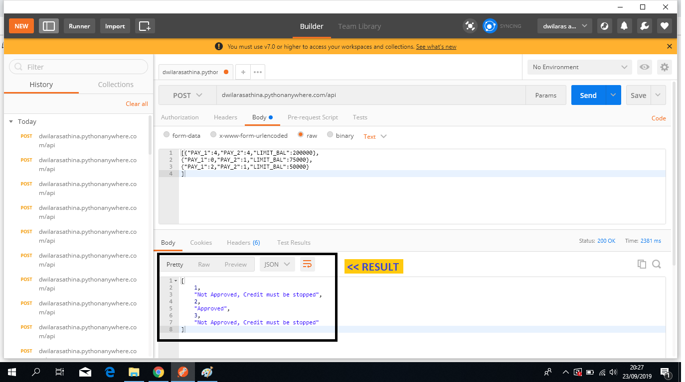

# Credit-Scoring-using-pythonanywhere
### **Previous Analysis**
I made exploratory data analysis and modeling from CreditCustomer dataset, [click here](https://github.com/dlathina/Credit-Scoring) to preview the result. The best classifier in that analysis is Random Forest Classifier. 

In this repositories, I uploaded the flask_app.py ([open github code](https://github.com/dlathina/Credit-Scoring-using-pythonanywhere/blob/master/flask_app.py) or [open in pythonanywhere](https://www.pythonanywhere.com/user/dwilarasathina/shares/f495f5816f744f1e922e5effe184ed25/))
and model_randomforest.pkl ([open github code](https://github.com/dlathina/Credit-Scoring-using-pythonanywhere/blob/master/model_randomforest.pkl))files 

### **VOILAAA !!!**
Now, you can use it for your company in the easiest way. First of all, Install **postman** to your computer. You can download it [here](https://www.getpostman.com/downloads/). 
Then, do the following instructions:
1. You have to add (+),  
2. Change 'GET' to 'POST', 
3. Fill the blank in 3 *dwilarasathina.pythonanywhere.com/api*
4. Choose 'Body'
5. Choose 'raw'
6. The last step is you have to input your data in box number (6). 

In detail, look at the picture below 

### How About the Data Input? 
Data you can input in box number (6) is customers data which include 
 - PAY_1 : Non negative, integer number. Payment in the 1st month by customers. 
        0 : Customer doesn't late to pay.
        1 : Customer late 1 month to pay.
        2 : Customer late 2 month to pay.
        and so on.
- PAY_2 : Non negative, integer number. Payment in the 2nd month by customers. 
        0 : Customer doesn't late to pay.
        1 : Customer late 1 month to pay.
        2 : Customer late 2 month to pay.
        and so on.
- LIMIT_BAL : Non negative number. Maximum Credit Limit. 

Example. There are 3 customers, with data record as the following table. 

| Customer ID  | PAY_1   | PAY_2   |LIMIT_BAL   |
| ------------ |:------: |:-------:|-----------:|
| 1            | 4       | 2       |200000      |
| 2            | 0       | 1       |75000       |
| 3            | 2       | 1       |50000       |

In the box number (6), please use this template. 
> [{"PAY_1":4,"PAY_2":4,"LIMIT_BAL":200000},
{"PAY_1":0,"PAY_2":1,"LIMIT_BAL":75000},
{"PAY_1":2,"PAY_2":1,"LIMIT_BAL":50000}
]

Then, you can see click "Send", and you will get the result like this. 
From that result, we know classification from each customer. The result should be : 

| Customer ID  | PAY_1   | PAY_2   |LIMIT_BAL   |RESULT                              |
| ------------ |:------: |:-------:|:----------:|-----------------------------------:|
| 1            | 4       | 2       |200000      |Not Approved, Credit must be stopped|
| 2            | 0       | 1       |75000       |Approved                            |
| 3            | 2       | 1       |50000       |Not Approved, Credit must be stopped|

